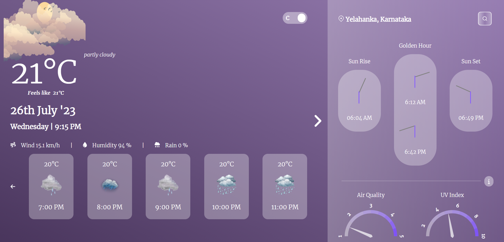

# Weather App
### View Deploy: [Click Here](https://msj-weather-app.netlify.app)

[](https://msj-weather-app.netlify.app)

## Build With
This project was built using these technologies:
  - React.js
  - HTML
  - CSS

## Clone My React Portfolio
Clone down this repository. 
You will need `node.js` and `git` installed globally on your machine.
```cmd
git clone https://github.com/Jaganath-MSJ/Weather-App.git
cd Job-Search
npm start
```
Check the web site in `http://localhost:3000`

## Deployed On
### [Netlify](https://www.netlify.com)
